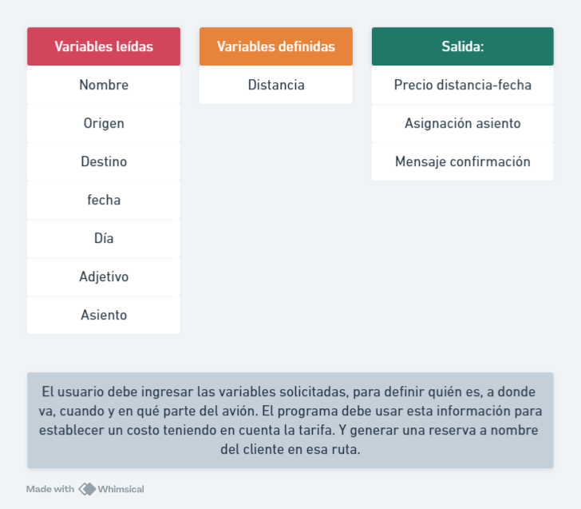

### Análisis:

### Diagrama de bloques:


### Pseudocódigo
```
Inicio
    Escribir("Sr. ó Sra.")
    Leer adj
    Leer nombre
    
    Escribir ("{adj}{nombre} Bienvennido a FastFast airlines.")
    
    Escribir ("Elegir destino: Medellín, Bogotá y Cartagena.")
    Leer destino
    
    Escribir ("Elegir origen: Medellín, Bogotá y Cartagena.")
    Leer origen
    
    Escribir ("Ingrese la fecha de viaje. Y el día de semana con un número del 1 al 7 (con 1 en lunes).")
    Leer fecha
    Leer día
    
    Si destino = Medellín:
        Si origen = Bogotá
            distancia = 1
        Si no distancia = 2
    
        Si destino = Cartagena:
            distancia = 2
    
        Si destino = Bogotá:
            Si origen = Medellín
                distancia = 1
            Si no distancia = 2
        Fin si    
    Fin si

    Si día < 5:
        Si distancia = 1
            precio = 79.900
        Si no precio = 156.900
    Si no 
        Si distancia = 2
            precio 119.900
        Si no precio = 213.000
    Fin si

    Escribir("Su subtotal es: precio Elija su asiento para terminar el proceso: Ventana, Medio, Pasillo.")
    leer asiento
    num = random number (1-29)

    Si asiento = ventana:
        letra = A ó F
    Si no
        Si asiento = pasillo:
            letra = B ó E
        si no:
            letra = C ó D

    Escribir("Su reserva ha sido confirmada. El vuelo de {origen} a {destino} el {fecha} ha sido reservado correctamente por un costo de {precio}.
    Su asiento asignado es el {num}{letra}. Gracias por volar con FastFast, esperamos vernos nuevamente muy pronto.")

```


    