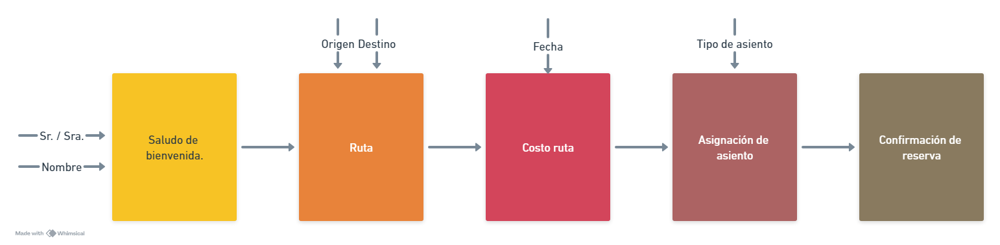

### Diagrama de bloques:

### Pseudocódigo
Inicio
    print(Sr. ó Sra.)
    Leer adj
    Leer nombre
    
    Print ("Bienvennido a FastFast airlines")
    
    Print ("Elegir destino: Medellín, Bogotá y Cartagena.")
    Leer destino
    
    print ("Elegir origen: Medellín, Bogotá y Cartagena.")
    Leer origen
    
    print ("Ingrese la fecha de viaje. Y el día de semana con un número del 1 al 7")
    Leer fecha
    Leer día
    
    if  0 < día < 5:
        

    