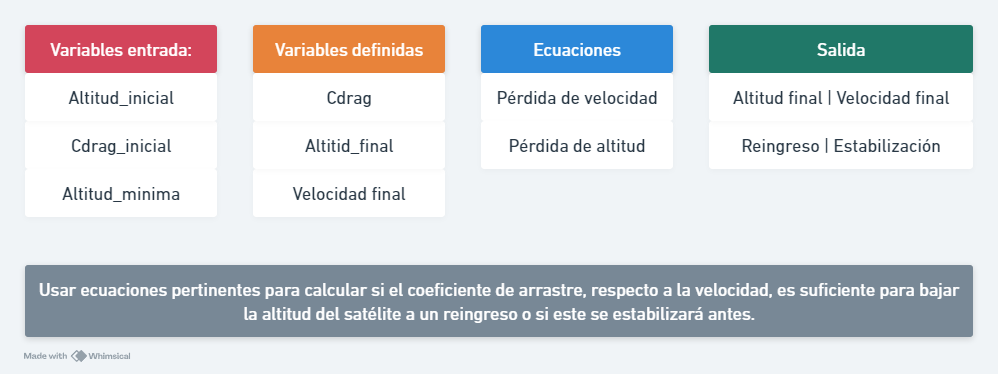
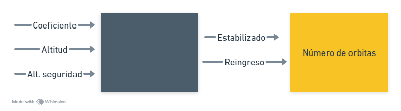

### Análisis:

### Diagrama de bloques:

### Pseudocódigo: 
```
Inicio
    leer alt_ini
    leer alt_min
    leer coef_drag
    altitud = alt_ini
    cont = 0
    mientras altitud > alt_min:
        altitud = altitud * coef_drag
        coef_drag = coef_drag + 0.0000000001
        cont = cont + 1
    
    Si altitud = altitud mínima:
    escribir("El satélite se estabilizó después de {cont} orbitas a una altitud de {altitud}")

    si no: 
    escribir("El satélite reingresó después de {cont} orbitas a una altura de {altitud}")
    Fin si
Fin
```